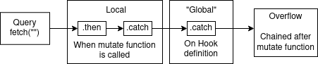

# React Mutation
[](https://badge.fury.io/js/react-mutation)<a href="https://bundlephobia.com/result?p=react-mutation@latest" target="\_parent">
  
</a>
<a href="https://github.com/vija02/react-mutation" target="\_parent">
  
</a>

`useMutation` hook for React and React Native. Tailored for thorough response handling.

## Get Started

```bash
yarn add react-mutation
# or
npm i --save react-mutation
```

## Usage
```tsx
const Button = () => {
  const [mutate, { isLoading, error, reset }] = useMutation(({ name }) => {
    return Promise.resolve(`Hello ${name}!`)
  }, {
    chainSettle: x => x.catch(catchAllError)
  })

  return (
    <button onClick={() => {
      mutate({ name: "World" }, (chain) => 
        chain.then((returnedString) => {
          // On success
          console.log(returnedString)
        }).catch((e) => {
          // On error
          console.error(e)
        })
      )
    }}>
      Call Mutate
    </button>
  )
}
```

## Features
- Designed for comprehensive error handling
- Compatible with React Native
- Supports async/await
- Built with Typescript

## Why use `react-mutation`?
We expose `isLoading` and `error` in the hook level allowing us to show appropriate status to user. 

`react-mutation` also allows great control over handling mutation responses. This library was built mainly for better error handling. We allow `then` and `catch` (or async/await `try` & `catch`) on all stages of the mutation.

These are: 
- Initial request
- Locally when the mutate function is called
- "Globally" when the hook is first defined 

Consider the following graph:



This library is tailored to allow promise chaining on various stages of the response. A standard flow could look like:
- Query - Calling edit profile API request
- Local - Handling alert if success. Catches validation error and alerting user.
- Global - Catches unexpected error, logging it to the cloud.

I don't recommend returning/throwing an error past "global" unless you know what you're doing. Eg: Catch using error boundary.

# API
## `useMutation(mutationFn, config?)`
> useMutation<TResult = any, TVariables = any>(mutationFn: (variables: TVariables) => Promise<TResult>, config?: MutationParamConfig<TVariables>): MutationReturn<TResult, TVariables>

### `mutationFn: (variables: TVariables) => Promise`
- Required
- A function that returns a promise. This is your main mutate function
- `variables` is an object that will be passed when you call the mutate function

### `config: MutationParamConfig`
> { onMutate, chainSettle }

#### `onMutate: (variables: TVariables) => void`
- Called immediately after mutate function is called
- This can be used for optimistic updates
#### `chainSettle: (chain: Promise) => Promise`
- Will be chained AFTER local
- Normally only used to `.catch`
- Example usage: `chainSettle: (chain) => chain.catch(e => console.error(e))`

## > Return
### `MutationReturn<TResult, TVariables>`
or equals to

```ts
MutationReturn<TResult, TVariables> = [
  MutationReturnFunction<TResult, TVariables>,
  MutationReturnConfig
]
```

### `MutationReturnFunction: (variables, chain?, overrideConfig?) => Promise`
- Call this function to execute the request
- `variables` will be passed to `mutationFn`
- Example usage: 
```ts
const [mutate] = useMutation(...)
mutate(variables)
```

#### `chain?: (chain: Promise) => Promise`
- Will be chained AFTER query and BEFORE "global"
- Example usage: 
```ts
mutate(variables, 
  chain => chain.then(x => console.log(x))
)
```
#### `overrideConfig?: MutationParamConfig`
- Refer to the config above
- If passed, this will be used instead of the value in config (per config key)

### `MutationReturnConfig: { isLoading, error, reset }`
- `isLoading`: `true` if mutation is being executed, otherwise `false`
- `error`: error object from `.catch`. `null` if no error
- `reset`: function to reset error back to null. Eg: `reset()`

# More Examples

## Standard error handling
This will call the error and log it, then let it be handled by `catchAllError`

`api.ts`
```ts
export default () => {
  return useMutation(({ name }) => {
    return Promise.reject()
  }, {
    chainSettle: x => x.catch(catchAllError)
  })
}
```
`component.tsx`
```tsx
import useApi from './api.ts'

const Button = () => {
  const [mutate] = useApi()

  return (
    <button onClick={() => {
      mutate({ name: "World" }, (chain) => 
        chain.catch((e) => {
          // On error
          // This will be called first
          console.error(e)
          throw e
        })
      )
    }}>
      Call Mutate
    </button>
  )
}
```

## Show loading/error state & reset
`api.ts`
```ts
export default () => {
  return useMutation(({ name }) => {
    return new Promise((resolve, reject) => setTimeout(resolve(name), 1000))
  })
}
```
`component.tsx`
```tsx
import useApi from './api.ts'

const Button = () => {
  const [mutate, { isLoading, error, reset }] = useApi()

  return (
    <>
      {isLoading.toString()}
      {error?.toString() ?? "null"}

      <button onClick={() => {
        mutate({ name: "World" })
      }}>
        Call Mutate
      </button>
      <button onClick={() => reset()}>Reset</button>
    </>
  )
}
```

## Optimistic Updates
```ts
export default () => {
  return useMutation(({ name }) => {
    return new Promise((resolve, reject) => setTimeout(resolve(name), 1000))
  }, {
    onMutate: (variables) => {
      const { name } = variables
      // Update cache
    }
  })
}
```

# Guides

## Use with Typescript
`react-mutation` is built using TS. You should be able to use it without doing anything.

Refer to [src/types.ts](src/types.ts) for most of the types we use., so you don't have to do anything to use 

## Chaining mutations
Sometimes, we'll want to chain mutations together. When one failed, then the rest shouldn't continue. Here's an example of how you might do this:
```tsx
const Button = () => {
  const [mutate] = useMutation(({ name }) => {
    return Promise.resolve(`Hello ${name}!`)
  })
  const [mutate2] = useMutation(({ name }) => {
    return Promise.resolve(`Hello, my name is ${name}!`)
  })

  return (
    <button onClick={async () => {
      try {
        await mutate({ name: "World" })
        await mutate2({ name: "Adam" })
      } 
      catch(e) {
        alert("Mutate failed!")
      }
    }}>
      Call Mutate
    </button>
  )
}
```
Notice that for this, we catch the error in a different way that normal. Usually we pass a chain function on the second parameter. Using await outside means that this is handled after the "global" handler. We let the error overflow and handle it ourself.

If you are using a catch-all error handling on the global level, then this wouldn't work. Since the error won't be thrown, an error in any of the `mutate` won't stop the rest from executing. 

For this, we can override the global chain by passing additional config when we call mutate. I also recommend having a default error handling function that you can easily trigger whether to propegate the error or not.

## Async / Await
Since we're just dealing with Promise, we can use async/await wherever we want. The only downside is it could be confusing which part of the promise are we dealing with.

`api.ts`
```ts
export default () => {
  return useMutation(({ name }) => {
    return new Promise((resolve, reject) => setTimeout(resolve(name), 1000))
  })
}
```
`component.tsx`
```tsx
import useApi from './api.ts'

const Button = () => {
  const [mutate, { isLoading, error, reset }] = useApi()

  return (
    <>
      {isLoading.toString()}
      {error?.toString() ?? "null"}

      <button onClick={() => {
        mutate(
          { name: "World" }, 
          async chain => {
            console.log("This is called before request is run")
            const res = await chain
            console.log("This is called after request is run (Same as after .then)")

            return res
          }
        )
      }}>
        Call Mutate
      </button>
      <button onClick={() => reset()}>Reset</button>
    </>
  )
}
```

# Other
## Contributions
Any contributions are welcomed. Create an issue/PR and I'll have a look at it as soon as possible. I'd love to see use cases and problems when using this.

## Further Improvements
- Docs could be better/clearer
- We could tighten the types, especially promise error types
- More examples
- Add tests

## Credits

Big thanks to [react-query](https://github.com/tannerlinsley/react-query) where a big part of our API is based from.